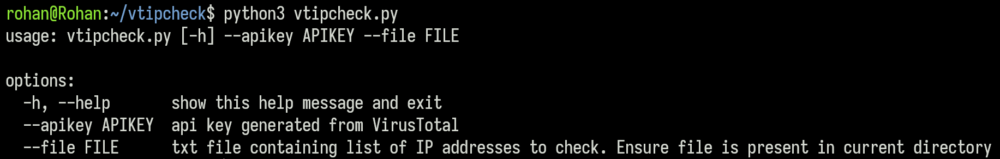

# VTIPCHECK

## Description
vtipcheck is a tool designed to verify if an IP address has been flagged as malicious by VirusTotal, providing valuable security advisories for variety of security solutions (like SIEM, Firewall, Defender etc).

- Currently only these headers are captured for the IP address: `IP, Malicious Count, Engines, Country Code, Last Analysis Date`
- This script is tested on **Public API** and there are some restrictions on it. You can read [this](https://docs.virustotal.com/reference/public-vs-premium-api) for reference.

## Installation
- [Generate API keys](https://docs.virustotal.com/reference/getting-started) from VirusTotal
- Clone the respository: `https://github.com/r0-han/vtipcheck.git`
- Install required python3 modules: `cd vtipcheck ; pip3 install -r requirements.txt`

## Usage

- Search list of IP addresses present in a file
    - `python3 vtipcheck.py --apikey <YOUR_API_KEY> --file <IP_FILE>`